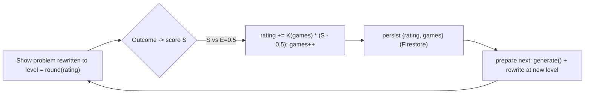

# Adaptive Difficulty for the Applications Tab — Spec

Status: built (this is the original design spec; kept for the rationale behind
the Elo model and the 1..15 prompt gradient). For the **as-built** Applications
tab — which now serves multi-step **scenario** problems, themes scenes to learner
interests, and AI-grades a free-response step — see
[`specs/08-applications-scenarios.md`](specs/08-applications-scenarios.md). The
core math/grading guarantee and the difficulty engine described here are still
accurate; where this doc and the code disagree, the code and spec 08 win.

Scope: the **Applications** tab only. Lessons and Practice are untouched. (The
motivation-stickers feature, parked in the original plan, is now built — see
[`specs/10-stickers-scrapbook.md`](specs/10-stickers-scrapbook.md).)

As-built deltas from this spec:

- Problems are multi-step scenarios (`ScenarioProblem`), not single-shot
  `WordProblem`s. The AI rewrites only the scenario `title` + `prompt`; steps,
  rubrics, hints, and answers are code-owned.
- The first conceptual step is an **AI-graded free-response** (`FrqStep`), graded
  by [`src/lib/aiGrade.ts`](../src/lib/aiGrade.ts) with rigor scaling by band
  (lenient/standard/strict); all other steps are graded in code.
- Scenes are **themed to learner interests** (`buildInterestClause` in
  `levelPrompts.ts`).
- Step visibility scales with difficulty via step `tier` (`guide`/`core`/
  `scaffold`) and `visibleSteps`.

This feature makes Applications problems adapt to the learner: answer well and
the problem's **wording** gets trickier and less obvious; struggle and it gets
plainer. The goal is to test a student's ability to **apply mathematics in
novel, real-world situations**. It is modeled on the "implied, not stated" style
documented in [uil-calc-problems.md](uil-calc-problems.md).

---

## 1. Core principle — the hard guarantee

The answer to every Applications problem is computed in code from fixed numbers
and graded by `gradeField` / `gradeProblem`. The AI may rewrite **only**
learner-facing text:

- `title`
- `prompt`
- each `field.label`

The AI may **never** change:

- the `given` formula block (e.g. `f(t) = 2t² + 5t`),
- the `fields` answers (`expected` / `trueCoefficients` / `options` / `correct`),
- which concept is being tested.

Because the answer lives in code and grading samples the typed value against
fixed expected values, **no rewrite can change correctness**. A bad rewrite is
detected by validation and we fall back to the base phrasing. This satisfies the
constraint: *change only how the problem is asked, never the content of what is
learned.*

---

## 2. Confirmed design decisions

- **Scale:** difficulty is **1–15** for fine granularity.
  - `1` borderline tells you what to do (maximally explicit, hand-holding).
  - middle levels read like ordinary word problems.
  - `15` is almost a short story where the question is *implied and never
    directly asked* — the student must realize what to compute.
- **Saved per-level prompts:** each level `1..15` has a fixed, hand-tuned prompt
  fragment (not dynamically invented) so output stays semi-consistent.
- **Adaptation:** an **Elo / chess-style** rating, not +/-1 every problem. A
  decaying K-factor makes the level move a lot early (fast calibration) and
  settle into small adjustments later (stability).
- **Persistence:** the rating is stored in **Firestore** on the user document,
  so ability carries across sessions and devices. A single **global** level per
  learner (fits the tab's hidden-concept UX).
- **Fallbacks:** signed-out / Firestore off → rating lives in memory for the
  session. AI unavailable / invalid output / timeout → base phrasing.

---

## 3. Difficulty model (Elo-style)

State per learner: `{ rating: number (1..15, float), games: number (int) }`.

- `INITIAL_RATING = 4` (ease in; ramps up as the learner succeeds). Tunable.
- The **served level** for a problem is `levelFromRating(rating) = clamp(round(rating), 1, 15)`.
- After each problem resolves, convert the `Outcome { solved, wrongAttempts,
  skipped }` to a score `S in [0,1]`:
  - first-try solve (`wrongAttempts === 0`) → `S = 1.0`
  - solved after 1 wrong try → `S = 0.6`
  - solved after `>= 2` wrong tries → `S = 0.3`
  - skipped / gave up → `S = 0.0`
  (Tunable in one table.)
- Expected score `E = 0.5` (the problem is served at the learner's own level, so
  a coin-flip is the neutral expectation).
- **Decaying K-factor** by games played `g`:
  `K(g) = K_MIN + (K_MAX - K_MIN) * exp(-g / TAU)` with defaults
  `K_MAX = 5`, `K_MIN = 0.75`, `TAU = 8`.
  - Early (`g≈0`): `K≈5` → a first-try solve jumps the rating ~+2.5, a miss
    drops it ~-2.5 (fast calibration).
  - Later (`g` large): `K≈0.75` → moves of ~±0.4 (stable, gentle).
- Update: `rating_new = clamp(rating + K(g) * (S - E), 1, 15)`; `games += 1`.

This is the chess-provisional idea: big swings while we don't know the learner,
shrinking as evidence accumulates, without lurching from a single answer.

---

## 4. What each level changes (difficulty dimensions)

Each saved level prompt dials these, escalating from 1 to 15 (from
[uil-calc-problems.md](uil-calc-problems.md): "lead with a situation, hide the
operation, make the student supply the setup, add distractors"):

- **Operation cue.** Low: names the everyday quantity plainly and nudges the
  goal. High: implies it (field label "Bugs produced on day 7" instead of "Rate
  of change in bugs").
- **Extraneous info.** Low: none. Mid: one irrelevant fact. High: several
  realistic-but-irrelevant numbers the student must filter out.
- **Directness.** Low: asks straight out. High: the ask is embedded in a
  scenario and only implied.
- **Story-ness.** Low: one or two sentences. High: a short narrative where the
  numbers live in the flavor text.
- **Scaffolding.** Low: may restate "you are looking for ___". High: none.
- **No jargon, ever.** No "derivative", "rate of change", "slope", "integral",
  "mean value theorem", etc. at any level.

The `given` formula stays **visible at all levels** — hiding it inside prose is
out of scope to protect answer integrity. (At high levels the surrounding story
carries extra, irrelevant numbers; the real formula is still shown verbatim.)

---

## 5. How the AI is used (and how code eases it)

Hybrid: code owns the rating, the saved prompts, the guardrails, and validation;
the AI only rewrites the displayed problem to the current level. Reuses
`getJsonModel(schema)` from [src/lib/ai.ts](../src/lib/ai.ts).

Note (doc correction): the Applications tab already calls the AI to brew the
random problem themes, so serving a rewritten problem is consistent with how the
tab already works — there is no truly "free" level. To bound cost/latency we
still use a one-ahead buffer and a fallback, and we may treat a single neutral
mid-level as "use base phrasing" only as an optimization, not a guarantee.

### Input payload to the model

- `level` (1..15) and its **saved** instruction fragment.
- `baseTitle`, `basePrompt`.
- `given` (the formula block) marked **READ-ONLY**.
- `fields`: for each `{ currentLabel, meaning, unit? }`, where `meaning` is a
  short machine description of the asked quantity (added as optional field
  metadata, §7) so the rewrite keeps the ask equivalent.

### Output (enforced via `Schema.object`)

```json
{ "title": "string", "prompt": "string", "fieldLabels": ["string", "..."] }
```

`fieldLabels.length` must equal `fields.length`, same order.

### Validation before use

Reuses `cleanText` + the banned-jargon list from
[src/utils/applications/madlib.ts](../src/utils/applications/madlib.ts):

- label count matches; every `title`/`prompt`/label is non-empty, within length
  caps, and free of banned jargon; prompt not absurdly long.
- On any failure, timeout (`REWRITE_TIMEOUT_MS = 9000` ms, up to 2 attempts), or
  AI unavailable → use the base problem unchanged.

Validated text is applied onto a **clone** of the `WordProblem`; the `given`
block and every `fields[*]` answer are copied verbatim.

### Saved prompt structure

A constant system line + a constant rules block + one **saved fragment per
level**. The fragments are authored and tuned by the build loop (§9) so outputs
are consistent and monotonic in difficulty.

System line:

> "You rewrite a real-world math word problem to a target difficulty by changing
> ONLY the wording. You never change the math and never reveal the answer. Output
> JSON only."

Constant rules block:

> - The GIVEN formula is displayed to the student exactly as provided; do not
>   change it, restate it differently, or invent numbers that belong to it.
> - Keep the SAME quantity asked for each answer blank (its meaning is provided).
>   Do not solve it or hint the numeric answer.
> - Use plain English. Never use math/operation names (no "derivative", "rate of
>   change", "slope", "integral", "mean value theorem", "acceleration", etc.).
> - Keep it solvable and unambiguous. Return JSON: `{ title, prompt,
>   fieldLabels[] }` with one label per blank, in order.

Per-level fragments live in `levelPrompts.ts` as `LEVEL_PROMPTS[1..15]`. Sketch
of the gradient (final wording tuned by the loop):

- L1–3: "State plainly what to find; nudge the everyday meaning; restate the
  goal; no distractions."
- L4–6: "Direct, concrete, minimal framing."
- L7–9: "Ask for the everyday quantity instead of naming any operation; add ONE
  realistic but irrelevant detail."
- L10–12: "Embed the ask in a short scenario; phrase indirectly; add TWO
  irrelevant numbers the student must ignore."
- L13–15: "Tell it as a short, vivid real-world story; never state the question
  outright (imply it); weave in THREE irrelevant but plausible numbers; no
  signposting of method."

---

## 6. UX / async pipeline

- A **one-ahead buffer** keeps things snappy: while the current problem is on
  screen, asynchronously prepare the next = `topic.generate()` + rewrite at the
  current level. On resolve, update the rating and refresh the buffered item if
  its level shifted.
- First problem / cache miss render quickly (base phrasing) and the rewrite swaps
  in when ready, or falls back to base on timeout.
- The numeric level is internal; the UI does not announce it (keeps the
  hidden-concept feel). An optional subtle "getting trickier" cue is off by
  default.



---

## 7. Files touched

As-built (current Applications scenario system; see
[`specs/08-applications-scenarios.md`](specs/08-applications-scenarios.md)):

- `src/utils/applications/difficulty.ts` — the Elo engine (as below).
- `src/utils/applications/levelPrompts.ts` — `LEVEL_PROMPTS[1..15]`, shared
  system/rules/style blocks, bands (`bandFor`, `IMPLIED_BAND_MIN`,
  `STORY_BAND_MIN`), `buildInterestClause` (interest theming),
  `buildRewritePrompt`, `validateRewrite`.
- `src/utils/applications/scenarioTypes.ts` — `ScenarioProblem` / `ScenarioStep`
  (`frq`/`number`/`expression`/`choice`), `tier`, `visibleSteps`,
  `resolveStepPrompt`.
- `src/utils/applications/scenarioRewrite.ts` — `rewriteScenario` (title+prompt
  only, `REWRITE_TIMEOUT_MS = 9000`, subject-term preservation, answer-leak
  validation).
- `src/utils/applications/scenarioGrade.ts` — `gradeCodeStep`,
  `heuristicGradeFrq`, `rigorForLevel`.
- `src/utils/applications/scenarios/` — per-lesson scenario registry
  (`lesson1..4`, `index.ts`, `APPLICATIONS_UNLOCK_LESSON`).
- `src/utils/applications/problemBuffer.ts` — prefetch buffer.
- `src/utils/applications/topicPicker.ts` — recency-weighted topic picker.
- `src/lib/aiGrade.ts` — AI free-response grading (rigor lenient/standard/strict).
- `src/pages/ApplicationsPage.tsx`, `src/components/applications/*` — UI wiring.
- `src/lib/firestoreValidation.ts` + `firestore.rules` — `applicationsRating`
  (1..15) / `applicationsGames`, and `applications/{uid}/topics/{topicId}`.

Original plan (single-shot `WordProblem` path, still present in code):

- `src/utils/applications/difficulty.ts` — `Outcome`, `RatingState`,
  `INITIAL_RATING`, `MAX_LEVEL=15`, `scoreFromOutcome()`, `kFactor(games)`,
  `levelFromRating()`, `nextRating(state, outcome)`.
- `src/utils/applications/levelPrompts.ts` — `LEVEL_PROMPTS[1..15]`, system line,
  rules block, `buildRewritePrompt(input)`, `REWRITE_SCHEMA`,
  `validateRewrite(raw, fields)`.
- `src/utils/applications/rewrite.ts` — `rewriteProblem(problem, level)`: calls
  `getJsonModel`, validates, applies onto a clone keeping `given`+answers
  verbatim, falls back to base on any failure/timeout.
- `src/lib/applicationsLevel.ts` — load/save `{rating, games}` on `users/{uid}`
  (mirrors [src/lib/progress.ts](../src/lib/progress.ts)).
- `src/hooks/useApplicationsLevel.ts` — load state + `applyOutcome()` that
  updates and persists (mirrors
  [src/hooks/useCompletedLessons.ts](../src/hooks/useCompletedLessons.ts)).
- `src/utils/applications/difficulty.test.ts` and `rewrite`/`levelPrompts` tests.

Edited:

- `src/utils/applications/types.ts` — add optional `meaning?: string` to field
  types (optional; rewrite falls back to the label if absent).
- `src/utils/applications/lesson1.ts`, `lesson2.ts`, `lesson3.ts` — populate
  `meaning` per field (additive; no math/grading change).
- `src/components/applications/WordProblemCard.tsx` — report `Outcome`
  (`wrongAttempts` / skip) via `onSolved`.
- `src/pages/ApplicationsPage.tsx` — hold rating from the hook, run the rewrite
  buffer, apply rewrites, update + persist on solve/skip.
- `src/lib/firestoreValidation.ts` — add `applicationsRating` (bounded number
  1..15) and `applicationsGames` (bounded int) to the user contract.
- `firestore.rules` — allow the two fields in `validUser` with the same bounds
  (needs a bounded-number helper, not just bounded-int).

---

## 8. Firestore persistence detail

- Store `applicationsRating: number` (1..15, float) and `applicationsGames:
  number` (int) on the existing `users/{uid}` doc via merged `setDoc`.
- Mirror bounds in both `firestoreValidation.ts` and `firestore.rules`
  (add an `isBoundedNumber(v, lo, hi)` rule helper for the float rating).
- New / signed-out / offline users default to `rating = INITIAL_RATING`,
  `games = 0` in memory.

---

## 9. Build via loop-agents (how this gets made)

Per the loop-agents skill, all four gates must pass in one round:

- **Coding** subagents implement the engine + persistence, the prompts +
  rewrite, and the UI wiring (disjoint files).
- **Prompt loop:** a generation subagent produces mock rewrites across levels
  1–15 for representative problems; a reviewer scores each for (a) accuracy
  (answer unchanged, given preserved), (b) linguistic sense, (c) correct
  difficulty ordering, (d) creativity; the prompts are refined until reasonable.
  Where live Firebase AI Logic calls aren't reachable from the test runner, the
  generation step is emulated by a model subagent acting as Gemini; the live code
  path is still implemented and used in the app.
- **Testing** gate: unit tests for `nextRating`/`kFactor`/`levelFromRating`,
  `validateRewrite`, `buildRewritePrompt`, and a self-consistency test proving a
  rewrite never changes `fields` answers. Full `npx vitest run` exit 0.
- **Optimization** gate (readonly): perf/duplication/idiomatic audit; hot path
  stays cheap; buffer doesn't refire or leak.
- **Real-world** gate (readonly): prompt quality across the scale + confirmation
  that nothing outside the listed files changed (Lessons/Practice/grading
  intact).

---

## 10. Non-goals / safety / tunables

- No change to math, the `given` formula, answers, grading, or which concept is
  taught.
- AI is best-effort: any failure → base phrasing, so the tab always works.
- Cost: one cheap text call per displayed problem (consistent with the existing
  theme calls); buffered ahead of time.
- Tunables in `difficulty.ts`: `INITIAL_RATING`, `K_MAX`, `K_MIN`, `TAU`, the
  score table, `MAX_LEVEL`, request timeout; and the saved fragments in
  `levelPrompts.ts`.
