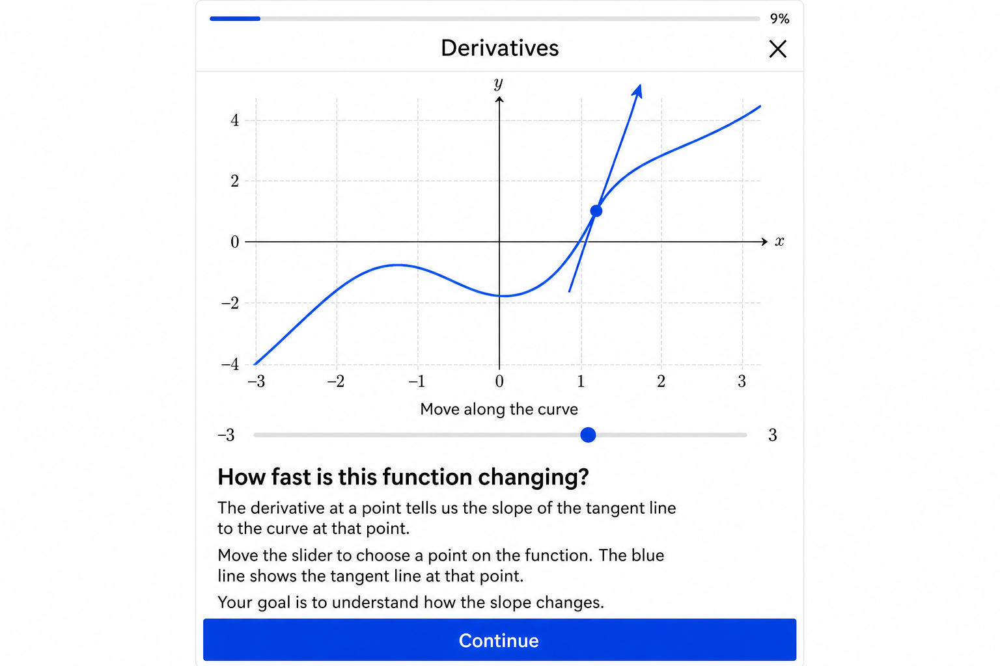
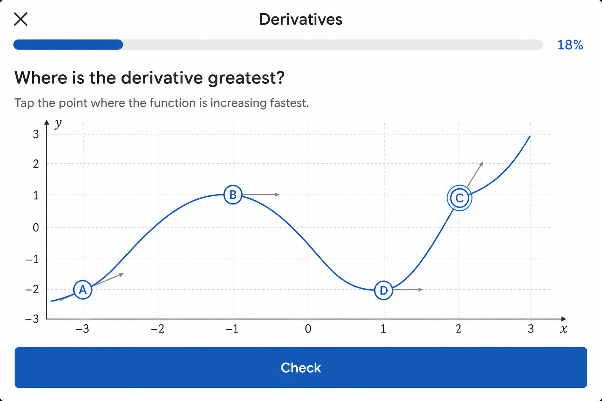

# Spec 03 — Design System & Lesson Shell (Slides 0–1)

## Design tokens

Aligned with [`src/index.css`](../../src/index.css):

| Token | Value | Usage |
|-------|-------|-------|
| `--accent` | `#1a5fb4` | Curve, arrows, CTAs, progress |
| `--surface` | `#ffffff` | Card, graph background |
| `--border` | `#e5e7eb` | Grid, borders |
| `--text-h` | `#111827` | Headings |
| `--text-muted` | `#6b7280` | Body copy |
| `--error` | `#b42318` | Wrong feedback sheet top border |

## Lesson player shell

Implemented in [`src/components/lesson/LessonPlayer.tsx`](../../src/components/lesson/LessonPlayer.tsx):

- 480px max-width centered layout
- Header: lesson title + exit link
- 4px progress bar
- Slide area with graph (320×240 SVG), copy, CTA
- Problem feedback: bottom sheet ([`FeedbackPopup.tsx`](../../src/components/lesson/FeedbackPopup.tsx))

## Slide 0 visual spec

- Blue curve on light grid
- Animated dot + tangent arrow on curve
- Scrub slider below graph
- **Continue** button

## Slide 1 visual spec

- **Single cubic curve passing through all four points A–D**
- Labeled tappable circles on the curve (not off-curve markers)
- Muted tangent arrows at each point as slope hints
- Selected point: blue ring
- **Check** → feedback popup on wrong; **Continue** on correct

## Route

`/lessons/derivatives-basics` — linked from home page lesson card.

## Acceptance criteria

- [x] Lesson shell matches mockups
- [x] Slide 1 graph passes through all four option points
- [x] Mobile-width layout (480px)
- [x] Touch targets ≥ 44px on CTAs and point labels
