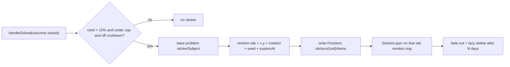

# Children's-Drawing Motivation Stickers (Pollinations)

> **Historical / superseded as of 2026-06-28.** This is the original plan; the
> feature is now built. For the as-built behavior see
> [`../specs/10-stickers-scrapbook.md`](../specs/10-stickers-scrapbook.md).

Status: planned (not yet built). Scope: a new decorative reward layer. Does NOT
change any problem math, grading, hints, difficulty, or Lessons/Practice logic.

Solving an Applications problem has a small chance to spawn a crayon-aesthetic
sticker themed to that problem. It appears in the background of a randomly
chosen tab and fades after a few days. Images are generated live and free via
Pollinations (text-prompt only) and rendered directly as an ``. There is
no image pack and no Firebase Storage.

## 1. Behavior (what the learner sees)

- Solve an Applications problem correctly -> small random chance (default 15%,
  with a cooldown + active-cap) to "earn" a sticker themed to that problem
  (fish problem -> a fish, balloon problem -> a balloon).
- The sticker appears in the **background of one randomly chosen tab**
  (`/`, `/practice`, `/applications`) at a random edge/corner, slightly
  rotated, like a kid's drawing taped to a fridge.
- Each sticker **expires after a few days** (default 5), then fades out; expired
  docs are lazily deleted.
- Decorative only: low opacity, behind content, `pointer-events: none`,
  `aria-hidden`, respects `prefers-reduced-motion`, and silently hides if the
  image fails to load.

## 2. Generation: Pollinations, live + free, text-prompt only

- Keyless GET returns an image directly, so we render via a plain `` —
  no pack, no storage, no backend:

  `https://gen.pollinations.ai/image/{encoded-prompt}?model=flux&width=512&height=512&seed={seed}&nologo=true&safe=true`

- `seed` is stored per sticker so the same drawing re-renders identically every
  load (Pollinations also caches by URL).
- **Style scaffold** (constant; only `{SUBJECT}` changes):

  > "A child's hand-drawn crayon picture of {SUBJECT}. Drawn by a 6-8 year old
  > with crayons and colored pencils on slightly textured off-white paper.
  > Thick, uneven, wobbly black outlines. Asymmetric imperfect shapes, visible
  > crayon strokes, coloring slightly outside the lines. Warm soft pastel
  > colors. One single {SUBJECT}, centered, lots of empty paper around it.
  > Cheerful, innocent, flat naive front-on perspective. No text, no letters,
  > no numbers, no signature, no watermark, no border."

- Reference-image anchoring is intentionally **out of scope** for now
  (decision: text-only). The same URL builder can later add `&image={publicRefUrl}`
  with `model=kontext` once the app is deployed and a reference image is hosted
  at a public URL.

## 3. Subject resolution (stable, survives the difficulty rewrite)

The difficulty feature rewrites titles via AI (`src/utils/applications/rewrite.ts`),
so we must NOT derive the subject from the (possibly obfuscated) live title.
Instead we stamp a stable subject onto the **base** problem at generation time,
and `rewriteProblem` preserves it (it spreads `...problem`).

- Add optional `stickerSubject?: string` to `WordProblem` in
  `src/utils/applications/types.ts`.
- New `resolveSubject(base)` in `src/lib/stickers/catalog.ts`: a centralized
  keyword map on the base `title` (e.g. `Fish hatchery -> fish`,
  `Weather balloon -> balloon`, `Pizza dough -> pizza`,
  `Drone altitude -> drone`, `Ice cube -> ice block`, `Solar panel -> sun`),
  with a `topicId` fallback table and a small `generic` celebratory set
  (star, balloon, trophy) for unmapped / AI-generated themes.
- Stamp it in one place: inside `randomProblem` in
  `src/pages/ApplicationsPage.tsx` (the single base-problem creation point), so
  no per-theme edits are needed across the lesson files.

## 4. Persistence (Firestore only)

- `stickers/{userId}/items/{itemId}` =
  `{ subject, seed, tab, x, y, rotation, scale, createdAt, expiresAt }`
  (x/y are 0..1 fractions; timestamps as epoch ms ints).
- URL is rebuilt client-side from `subject + seed` via the scaffold (keeps docs
  tiny; lets us retune the scaffold later).
- Security: extend `firestore.rules` with an owner-scoped, validated `stickers`
  subcollection mirroring the existing `validUser` / `validProgress` pattern;
  add `isValidStickerItem` to `src/lib/firestoreValidation.ts`.
- No Firebase Storage init required.

## 5. Runtime flow

## 6. New code

- `src/lib/stickers/`:
  - `catalog.ts` — subject keyword/topic maps + `resolveSubject`.
  - `url.ts` — `buildStickerUrl({ subject, seed })`.
  - `types.ts` — `StickerItem`.
  - `store.ts` — `addSticker`, `listActiveForTab(tab)`, `deleteExpired` (lazy).
  - `trigger.ts` — `maybeSpawnSticker(problem, uid)`: probability + cooldown +
    max-active cap, builds and writes the instance. Pure, dependency-injected
    randomness for testability.
- `src/components/stickers/StickerLayer.tsx` (+ `.css`) — fixed full-viewport,
  `pointer-events:none`, low-opacity overlay; loads the current tab's active
  stickers, renders each as a slightly-rotated taped drawing with fade-in /
  fade-near-expiry; `img onError` hides; reduced-motion aware.

## 7. Wiring (minimal edits)

- `src/pages/ApplicationsPage.tsx`: in `handleSolved`, when `outcome.solved`,
  call `maybeSpawnSticker(problemRef.current, uid)` (best-effort, swallow
  errors). Stamp `stickerSubject` in `randomProblem`. This is the only
  behavioral edit; difficulty / gating logic untouched.
- `src/App.tsx`: wrap the `ProtectedRoute` children in a small layout
  (`<Outlet/>` + `<StickerLayer/>`) so the background layer mounts once across
  all three tabs; `StickerLayer` reads the active tab via `useLocation`.
  Lessons / Practice page code stays untouched.

## 8. Defaults (tunable in one config)

- Spawn chance 15%; lifetime 5 days; max 6 active per user; per-solve cooldown
  so two don't pop back-to-back; render opacity ~0.5; model `flux`, 512x512;
  random stored `seed`.

## 9. Scope / non-goals / risks

- Does NOT change any problem math, grading, hints, difficulty, or
  Lessons/Practice logic.
- Pollinations anonymous tier has rate limits; volume here is tiny, and failures
  degrade gracefully (sticker just doesn't render).
- Style is text-prompt-driven (close, not pixel-matched to the reference
  drawings); reference-image anchoring is a future add via `&image=` once
  deployed.

## 10b. Build revisions (approved 2026-06-25)

These supersede the relevant parts above:

- **Image provider = OpenAI primary, Pollinations fallback.** When
  `VITE_OPENAI_API_KEY` is present, generate with `gpt-image-1`
  (`background: 'transparent'`, `quality: 'low'`, png) for true crayon-sticker
  cutouts, reusing the existing browser `fetch` pattern in `src/lib/ai.ts`.
  Persist the PNG to Firebase Storage (`stickers/{uid}/{itemId}.png`) and store
  its download URL. If the key is missing or the call/CORS fails, fall back to a
  reproducible Pollinations URL (`flux`, `seed`). The stored doc keeps a final
  `src` URL so the renderer is provider-agnostic.
- **Firebase Storage is now used** (bucket already configured). Init
  `getStorage(app)` in `src/lib/firebase.ts`; add `storage.rules` (owner-scoped
  `stickers/{uid}/**`) and a `storage` entry in `firebase.json`.
- **Show on every page/slide, not one tab.** `StickerLayer` mounts once in
  `src/App.tsx` (returns null when signed out) and renders ALL of the user's
  active stickers as a fixed background on every route/slide. No `tab` field.
- **Scrapbook placement in the margins only.** Stickers occupy a fixed,
  ordered list of margin slots (alternating left/right down the side gutters of
  the centered content column), assigned by `slotIndex` in order — never over
  the main content or center. Hidden on viewports too narrow to have margins.
- **Size** ~100px (about 2x the 50px `.home-lesson-icon`), slight per-slot
  rotation for a taped-scrapbook feel.
- **TESTING:** spawn chance = 1 (a sticker after every correct answer). A single
  `SPAWN_CHANCE` constant in `src/lib/stickers/config.ts` flips back to 0.15 for
  production. Max active = slot count; oldest is evicted (doc + Storage file)
  when full.
- **Shared tunables** live in `src/lib/stickers/config.ts`
  (`SPAWN_CHANCE`, `LIFETIME_MS`, `STICKER_SLOT_COUNT`, size) imported by both
  the lib and the UI so slot count stays in sync.

## 10. Build checklist

1. Add `stickerSubject` to `WordProblem`; build `catalog.ts` + `url.ts`.
2. Add `stickers/{uid}/items` Firestore model: `types.ts`, `store.ts`,
   `firestore.rules` + `firestoreValidation.ts` validation.
3. Implement `trigger.ts`; hook into `ApplicationsPage` `handleSolved`; stamp
   `stickerSubject` in `randomProblem`.
4. Build `StickerLayer` (+css); mount once via an `App.tsx` protected-route
   layout; per-tab render, fade in/out, reduced-motion + `img onError`.
5. Unit-test trigger / expiry / subject-mapping; run build + lint; verify no
   Applications / difficulty / Lessons / Practice regressions.
